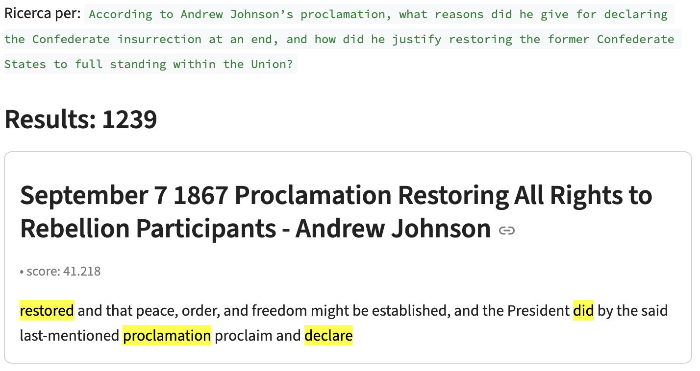

# Introduzione

Il dataset utilizzato per questo homework è gestito dal Miller Center of Public Affairs dell’University of Virginia e consiste principalmente in una raccolta di discorsi pronunciati dai vari Presidenti degli Stati Uniti, da George Washington fino ai più recenti. Per adattarlo al compito assegnato, ho convertito i file JSON in formato .txt (sì, JSON → txt e poi → JSON di nuovo per indicizzare, non una grande idea ma è per attenersi alla traccia proposta, virtualmente partiamo da txt → JSON), così da poter iniziare da questa base.

Il titolo dei singoli file .txt ha la seguente formattazione:
```data of speech - president name ```

Questa è una semplificazione che faccio (e che verrà discussa meglio dopo) poiché i titoli inzialmente si basavano solo su data ed evento, rendendo difficile pensare e comprendere i risultati di query sul campo title. I singoli speech contengono tag HTML, come \textless br\textgreater, che vengono filtrati nell'esecuzione di uno script, dove si esegue anche il chunking del contenuto testuale dello speech; quest'ultimo è un chunking semplice con overlap: una soluzione facile da implementare e adeguata agli obiettivi di questo homework, anche se meno adatta a sviluppi futuri, come l’integrazione di dense vectors. ElasticSearch utilizza BM25 come metrica di ranking predefinita: BM25 è un’evoluzione di TF-IDF che corregge il bias verso i documenti lunghi introducendo una normalizzazione non lineare della lunghezza;
la rilevanza di un termine cresce con la sua frequenza, ma in modo saturante: ripeterlo troppo non aumenta indefinitamente il punteggio.
In questo modo BM25 fornisce score generalmente migliori e più performanti. Alla luce di quanto detto, c’è sostanziale differenza nell’indicizzare chunk o documenti nella loro totalità: suddividere in chunk permette a BM25 di cogliere meglio la rilevanza locale dei termini, evitando che la lunghezza diluisca il punteggio. Indicizzare tutto insieme penalizza le sezioni specifiche e riduce la precisione del ranking sui temi trattati solo in parte del testo.

Al seguente link: **[https://github.com/ddemarchis11/Homework-2-Ingegneria-dei-Dati](https://github.com/ddemarchis11/Homework-2-Ingegneria-dei-Dati)**  
si trova il codice a supporto e le indicazioni per come eseguirlo, sia tramite script automatizzato che manualmente; per interagire con ElasticSearch ho realizzato un’interfaccia utente (UI) in Streamlit, dotata di una barra laterale che consente di specificare i campi su cui effettuare la ricerca ed il numero di risultati da visualizzare; riguardo a quest' ultimi, manteniamo comunque un riferimento al totale dei risultati restituiti da ElasticSearch, mentre per la ricerca sono state lasciate le impostazioni predefinite di best field.

Per agevolare l’interazione, la UI propone alcune suggestions di ricerca che permettono di comprendere fin da subito quali siano le richieste tipiche per il dataset di 'political speech' preso in considerazione.


# Indexing Time ed Analyzers
I campi, come indicato nella traccia, sono titolo e contenuto dello speech; entrambi devono essere resi interrogabili creando un indice con i relativi field.
Utilizzando il client di ElasticSearch in Python, è possibile creare l’indice con pochissime righe di codice.
Per l’indicizzazione dei documenti ho scelto la modalità bulk, ovvero l’invio di tutti i documenti in un’unica operazione, evitando chiamate API separate per ciascun elemento. Questa scelta ha un lieve impatto sul tempo di indicizzazione, che viene calcolata utilizzando la libreria time di Python, misurando il tempo trascorso (elapsed time) dopo l’esecuzione dell’indicizzazione in modalità bulk, come mostrato di seguito.
```python
start = time.perf_counter()
success, _ = helpers.bulk(es, actions, request_timeout=120)
elapsed = time.perf_counter() - start
```

Il codice completo è visibile nel file 'indexer.py'.
Riguardo agli Analyzers utilizzati, il ragionamento è il seguente: nel caso del campo 'content', che contiene un political speech, l’utilizzo di un analyzer standard in Elasticsearch è una scelta appropriata; l'analyzer standard divide il testo in token basati sui confini “parola” secondo lo standard Unicode, converte in minuscolo e rimuove maggior parte della punteggiatura, producendo token puliti per l'indexing.
Poiché un discorso politico è composto da frasi articolate e lessico generico, non specialistico (aspetto FONDAMENTALE), un analyzer più complesso o personalizzato non apporterebbe vantaggi significativi. In realtà, l’analyzer utilizzato è un analyzer custom, ma mantiene le stesse regole di base dello standard analyzer sulla tokenizzazione, intervenendo solo sugli aspetti “di contorno”.
In particolare ho aggiunto:
- english_possessive_stemmer: rimuove la forma possessiva (’s)
- asciifolding: normalizza i caratteri accentati o speciali
- english_stop: elimina le stopword inglesi comuni
- english_stemmer: riduce le parole alla radice (Porter stemmer)

che, si noti, sono tutte operazioni 'standard'nell'Indexing tradizionale, nulla di domain - specific.
Nel caso del campo title, ho deciso comunque di utilizzare uno standard analyzer, ma evitando stopping e stemming. L'applicazione di questi non è consigliabile perché i titoli in questo dataset non rappresentano testi narrativi o discorsivi, ma etichette descrittive e semantiche di eventi. Includono spesso nomi propri, luoghi, date e termini chiave che identificano univocamente l’occasione (es. “Press Conference in the East Room”, “Message Following the Death of Abraham Lincoln”). L’uso dello stemming potrebbe alterare queste parole riducendole alla radice e rendendo diversi titoli tra loro indistinguibili, ad esempio: “Address to the Nation” e “Address of the Nation” diventerebbero equivalenti nonostante logicamente documenti distinti, come "Message on the Economic Recovery Plan" e "Message about Economic Recovery Plans" sarebbero ridotti alla stessa indicizzazione nonostante la seconda parli di più piani. Analogamente, la rimozione delle stopwords eliminerebbe termini funzionali ma semantemente rilevanti in questo contesto (come “of”, “to”, “on”), compromettendo la precisione nella ricerca. 

Ovviamente, gli stessi analyzer vengono applicati sulla query in ingresso, come da default, altrimenti i risultati sarebbero discordanti.

## Considerazioni
In realtà, la formattazione del titolo non è stata una scelta arbitraria né un modo per complicare le cose: essa deriva semplicemente dall’unione dei due campi “title” e “president” presenti nei file JSON originali. L’utilizzo di uno standard analyzer rappresenta, a mio avviso, la soluzione più equilibrata per ottenere buoni risultati con il minimo sforzo, soprattutto considerando i vincoli dell’homework, che richiede l’indicizzazione di soli due campi. Di conseguenza, informazioni come la data e il nome del presidente, pur essendo ricavabili dal titolo o dai campi originali, non possono essere indicizzate separatamente. In un’applicazione di search reale, invece, una progettazione più accurata dell’indexing prevederebbe la creazione di inverted index distinti e querable singolarmente per i campi “president” e “date”, supportati da un modello di Named Entity Recognition (NER) in grado di identificare tali entità direttamente nella query dell’utente. Nonostante non abbia sperimentato direttamente questo approccio, posso affermare con buona sicurezza che offrirebbe risultati più accurati rispetto alla semplice indicizzazione del titolo con uno standard analyzer, come fatto in questo caso. Inoltre, poiché un evento rappresenta un concetto fortemente topologico e semantico, avrebbe senso costruire anche un vector index basato sui dense vectors generati da un Sentence Embedder, così da catturare le relazioni semantiche tra i contenuti. Tuttavia, come per l’approccio con il NER, anche questa soluzione esula dagli obiettivi di un homework introduttivo come questo e la lasciamo, quindi, solo come spunto teorico.
Ho scelto questo dominio proprio perché mi consentiva di discutere anche strategie più realistiche, pur restando all’interno dei vincoli imposti dall’esercizio.

# Query e Risultati
Riguardo il tempo di indicizzazione, i seguenti risultati sono ricavati su un insieme di 5 run distinte del bulk di costruzione dell'indice ed un average sugli elapsed times relativi.


Le query con cui ho provato il sistema si dividono nei seguenti:
- 5 Content Queries di diversa complessità, concepite per simulare domande poste da un utente che desidera ottenere informazioni esplicite contenute nei documenti — in uno stile analogo a quello utilizzato per interrogare un linguaggio naturale o un modello linguistico e che è una parte importante anche dei motori tradizionali
- 2 Title Queries molto generiche orientate al 'president', utili a testare la search sul title 
- 1 Phrase Queries per testare l'exact match
-  2 Semantic Queries per comprendere i limiti degli approcci basati su full text search


## Content Queries

Le prime quattro Content Queries seguono una struttura precisa: sono organizzate in due coppie di query, dove la prima di ciascuna coppia è più semplice e diretta, mentre la seconda risulta più articolata. In entrambi i casi, le informazioni ricercate non sono di natura semantica, ma esplicitamente presenti nel testo. Di conseguenza, il sistema di retrieval si comporta come previsto, restituendo risultati molto accurati.


Le due query di ogni coppia fanno riferimento allo stesso discorso e, infatti, lo individuano correttamente. Lo stesso comportamento si osserva anche per la seconda coppia di query, confermando le aspettative iniziali.




Diverso è il caso dell’ultima query del gruppo, che è volutamente più generica: chiede, ad esempio, di individuare discorsi sulla 'foreign policy'. 


Poiché molti speech trattano questo tema, la query, essendo vaga, produce una risposta altrettanto vaga. Il motore tende a favorire i documenti che contengono entrambi i termini “foreign” e “policy”, piuttosto che solo uno dei due. Tuttavia, non è possibile individuare un criterio deterministico per l’ordinamento dei risultati: la variabilità è coerente con la genericità della richiesta stessa.

## Title Queries
Abilitando la ricerca sul titolo, la formattazione adottata consente di individuare facilmente tutti i discorsi relativi a un determinato presidente o a un periodo storico specifico, ad esempio tramite query come “Coronavirus Donald Trump” o “Abraham Lincoln”.


L’inclusione del nome del presidente nel titolo nasce proprio da questa esigenza: è infatti poco probabile che un utente ricerchi l’evento utilizzando le parole esatte del titolo originale, che spesso differisce da come ci si aspetterebbe di trovarlo in contesti più convenzionali, come libri o film.


Questa seconda query è per mostrare il funzionamento anche della ricerca del titolo completo (concatenazione di data e event name), anche se, come abbiamo discusso precedentemente, sicuramente meno comune.

## Phrase Queries
Le Phrase Queries sono query racchiuse tra virgolette, in cui il sistema ricerca i documenti che contengono esattamente quella sequenza di parole consecutive, nello stesso ordine in cui sono state scritte. Pur non essendo le più interessanti da analizzare, rivestono comunque un certo valore, poiché un utente potrebbe voler individuare un passaggio preciso di un discorso. Per questo motivo, nel nostro caso, ne è stata inclusa solo una a titolo esemplificativo.


## Semantic Queries
In questo caso la situazione è più interessante, in quanto chiediamo esplicitamente un retrieval di informazione che necessita comprensione semantica e non funziona notoriamente bene per una full text search.


Nella prima query si richiedono gli speech in cui la tecnologia viene discussa come una “minaccia” (threat) per la democrazia. Pur sembrando una richiesta semplice, si tratta in realtà di un caso in cui non viene cercata un’informazione esplicita, come nelle Content Queries, ma un concetto che richiede una reale comprensione semantica. I risultati, infatti, mostrano una certa incoerenza: i primi due speech restituiti non rispondono al significato complessivo della domanda, ma soltanto a singoli termini. Il primo discorso parla di democrazia, il secondo di tecnologia, ma nessuno dei due tratta il rapporto tra le due. Il discorso 'ground' a cui la query dovrebbe far riferimento è il recente "Farewell Address" di Joe Biden alla fine del suo mandato presidenziale, presente nel dataset.


Lo stesso fenomeno si osserva nella seconda query, in cui si chiede di individuare il discorso in cui il presidente parla della Costituzione non come un semplice insieme di regole, ma come una guida per il futuro della nazione. Anche in questo caso, i documenti restituiti risultano fuori contesto: lo speech corretto, infatti, è il celebre discorso del secondo insediamento di Barack Obama, “January 21 2013 Second Inaugural Address”.